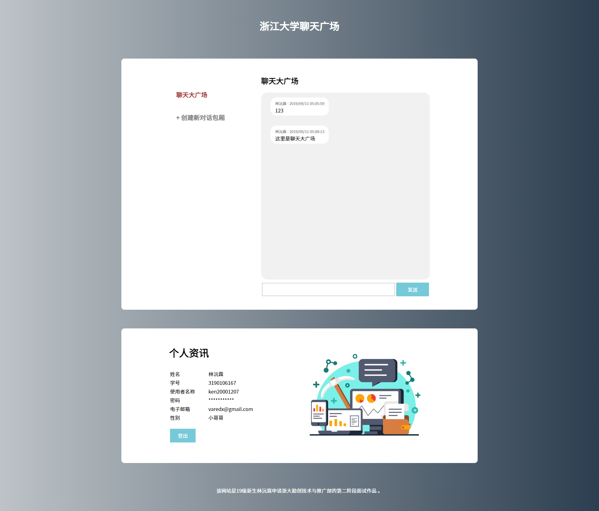
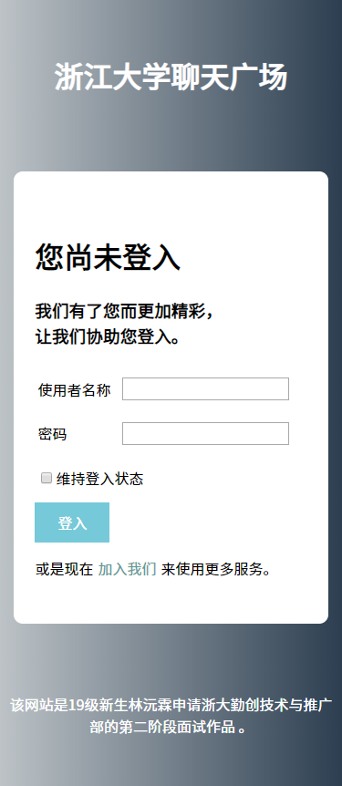

# ZJU-Square Node JS Edition 浙江大学聊天广场 Node JS 版

本网站为浙江大学 19级新生林沅霖参加浙大勤创技术推广部秋季纳新的第二阶段面试作品。  
且为 [ZJU-Square 浙江大学聊天广场](https://github.com/ken20001207/zjusquare) 的另一种版本，  
完全使用 Node JS 取代 PHP 编程。   

## 功能说明

本网站是一个即时通讯网页服务，注册账号后可在本网站与他人讯息交流。  
使用者可自行开设对话频道来与不同群体的使用者交流。  

## 前置需求

本网站需要使用 Node 运行网站服务器，  
输入 "node index.js" 即可访问服务主页，  
且需要与 MySQL 数据库沟通，以执行其完整功能。  

MySQL 的配置如下：  

需要一个数据库，并将数据库地址、数据库使用者名称、数据库使用者密码以及数据库名称输入在 index.js 内，  
该数据库需要有两张资料表："users" 和 ”message”。  

users 资料表用于储存网站使用者资料，其结构如下：  

message 资料表用于储存网站内的对话记录资料，其结构如下：  

git 中附有 .sql 设置文件，可供直接下载使用。  

## 网页截图

登入画面  

注册画面  

主画面

登入画面 （自适应为手机版面）

注册画面 （自适应为手机版面）

主画面 （自适应为手机版面）

